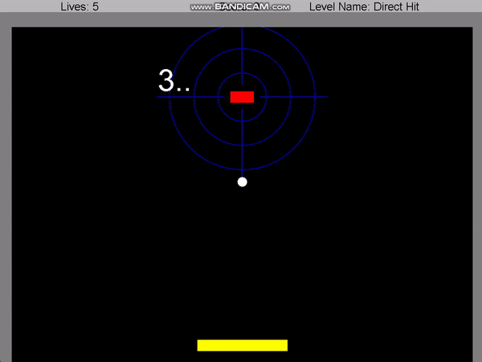

# Arkanoid-Game
The old classic Arkanoid game in java language
<h4>An Arkanoid game for Object Oriented Programing course.</h4>

This project was coded as a 7-part ongoing assignment on the 2nd semester of my 1st year at BIU. This project was coded using a single thread, which is rare for games such as this. Also, it uses no Java GUI Built-In objects, instead, I used a GUI implementation which is included in this repository. I implemented a version of the Arkanoid game, as part of the OOP course i took during my bachelor degree.
The game contains various levels with increasing difficulty, in a gui friendly platform.
I implemented the game with Java language using Intellij IDEA Ultimate IDE, using the following OOP principals:

<ul>
  <li>Polymorphism and inheritance.</li>
  <li>Usage of basic design patterns in OOP, such as Observer, Builder, etc.</li>
  <li>Usage of several generic collections and data structures such as linked lists and arraylists.</li>
  <li>Working with GUI.</li>
</ul>

<h1>Dependencies</h1>

<ul>
  <li>Windows / Linux / macOS</li>
  <li>Git</li>
  <li>Keyboard that contains: Spacebar (for stoppage), "P" button, and all arrows.</li>
  <li>Apache Ant</li>
</ul>

<h1> How To Run? </h1>

You can run this game in 3 options:

<ol>
  <li><h4>With Apache Ant</h4>Download the source code to any folder, open terminal in the main folder and write: "ant" 
  this command will build the game, after that write commnad: ant run -Dargs="{levels}" where as levels is which levels you want to load. for example 
  if you want level 1, 3 and 4 just write: ant run -Dargs="{1 3 4}" at that order.</li>
  <li><h4>Executable Jar File</h4> Just download the release jar and double click on it (make sure you have JDK installed)</li>
  <li><h4>Opening Project From IDE</h4> Just download the source code and open the project from the IDE and rebuild it.</li>
</ol>
